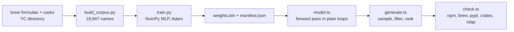

```
 ██████╗ ██╗     ██╗████████╗██╗  ██╗███████╗██████╗
 ██╔══██╗██║     ██║╚══██╔══╝██║  ██║██╔════╝██╔══██╗
 ██████╔╝██║     ██║   ██║   ███████║█████╗  ██████╔╝
 ██╔══██╗██║     ██║   ██║   ██╔══██║██╔══╝  ██╔══██╗
 ██████╔╝███████╗██║   ██║   ██║  ██║███████╗██║  ██║
 ╚═════╝ ╚══════╝╚═╝   ╚═╝   ╚═╝  ╚═╝╚══════╝╚═╝  ╚═╝
```

<div align="center">

### `NAMES FOR YOUR NEXT CLI, APP OR STARTUP // NO LLM WAS CONSULTED`

*a 49k-parameter character model that has read every Homebrew formula and YC company, and now talks nonsense*

    -157a4b?style=flat-square&labelColor=111111)

</div>

---

## 🔤 What is this

Naming a project is the part that takes longest. blither does it badly and fast: a character-level neural net, trained from scratch in NumPy on 8,309 Homebrew formulae, 4,628 casks and 6,010 YC companies, guesses one letter at a time until it hits the end of a word. You tell it what you are naming (cli, app, startup) and how bold to be, and it hands you a batch. Every name is then checked live against npm, Homebrew, PyPI, crates.io or the .com/.dev/.ai registries, so you find out it is taken before you get attached.

The model is 195 KB of float32 and runs in the page. There is no server, no API key and nothing to rate-limit. The seed sits in the URL, so a batch you liked is a link, not a screenshot.

It is a fork of the idea behind [yname](https://github.com/aadithyanr/yname), which does this for YC names only. blither's own name came out of the model (cli, sensible, seed 2, ninth in a batch of ten). It means "to talk nonsense", which is fair.

```console
nick@blither:~$ uv run --with numpy model/train.py
[✓] 18947 names, 158361 train examples, 17737 val examples
[✓] best val loss 2.425 (perplexity 11.3). about eleven plausible next letters at every step.
[i] exported 195152 bytes of weights. the whole model is smaller than this readme's fonts.
```

## 🎛 The knobs

| | knob | what it actually does |
|---|---|---|
| 01 | **for a: cli / app / startup / any** | picks the category embedding fed into the model. cli names come out hyphenated and lowercase, startups come out with "ai" glued on the end. any rolls a category per name |
| 02 | **sounding: sensible / bold / unhinged** | sampling temperature, 0.66 up to 1.24. sensible sticks to letters the model is sure about, unhinged does not |
| 03 | **another** | new seed, new batch of five. the URL updates so you can send it to someone |
| 04 | **the registry list** | one fetch per registry straight from the browser (they all allow CORS). 404 means free, 200 means someone got there first |
| 05 | **also in this batch** | the other four names, ranked by how likely the model found them, minus penalties for length, extra words and filler like "labs" |

## 🚀 Run it

You need Bun for the site and uv for the trainer. Retraining is optional, the exported weights are committed.

```bash
git clone https://github.com/nitrimandylis/blither.git
cd blither/web
bun install
bun run dev
```

To retrain (six seconds on an M3 Pro):

```bash
python3 data/build_corpus.py
uv run --with numpy model/train.py
```

It overfits past 4,000 steps, so the default stops there.

## 🔩 Under the hood



| file | job |
|---|---|
| `data/build_corpus.py` | merges the three sources into `corpus.csv`, drops fonts and `@versions`, keeps 2 to 20 chars |
| `model/train.py` | the whole trainer: embeddings, tanh hidden layer, softmax, hand-written backprop, Adam, export |
| `web/src/lib/model.ts` | loads the weights and runs one forward pass, same maths as the trainer |
| `web/src/lib/generate.ts` | seeded sampling (mulberry32), usability filters, edit-distance check against every known name, scoring |
| `web/src/lib/check.ts` | availability lookups per category, all client side |
| `web/src/App.tsx` | the one page |

The architecture is the Bengio et al. 2003 neural probabilistic language model: the previous 10 characters go through 24-dim embeddings, get concatenated with a 12-dim category embedding, pass a 160-unit tanh layer and come out as logits over 44 tokens. Nothing in it is newer than 2003 except the browser.

**Stack:** NumPy · Vite · React · TypeScript · IBM Plex

---

<div align="center">

**[Nick Trimandylis](https://github.com/nitrimandylis)**

`ELEVEN PLAUSIBLE LETTERS AT EVERY STEP, PICK ONE`

MIT licensed. Training data from Homebrew and, via yname, the YC directory. Not affiliated with either.

</div>
