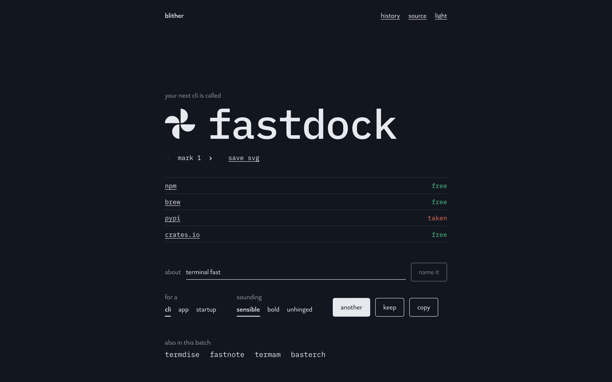
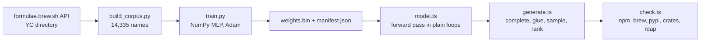

```
 ██████╗ ██╗     ██╗████████╗██╗  ██╗███████╗██████╗
 ██╔══██╗██║     ██║╚══██╔══╝██║  ██║██╔════╝██╔══██╗
 ██████╔╝██║     ██║   ██║   ███████║█████╗  ██████╔╝
 ██╔══██╗██║     ██║   ██║   ██╔══██║██╔══╝  ██╔══██╗
 ██████╔╝███████╗██║   ██║   ██║  ██║███████╗██║  ██║
 ╚═════╝ ╚══════╝╚═╝   ╚═╝   ╚═╝  ╚═╝╚══════╝╚═╝  ╚═╝
```

<div align="center">

### `NAMES FOR YOUR NEXT CLI, APP OR STARTUP // NO LLM WAS CONSULTED`

*a 49k-parameter character model that has read every Homebrew formula and YC company, and now talks nonsense*

    -157a4b?style=flat-square&labelColor=111111)

[](https://blither.vercel.app)

</div>

---

## 🔤 What is this

Naming a project is the part that takes longest. blither does it badly and fast: a character-level neural net, trained from scratch in NumPy on 5,551 Homebrew formulae, 3,038 casks and 5,746 YC companies, guesses one letter at a time until it hits the end of a word. You tell it what you are naming (cli, app, startup), a few words about what it does, and how bold to be, and it hands you a batch: two of your words glued to the parts real names are made of (`token` + `wave`, ranked by how name-like the model finds them) and three spins of the model itself, some started from your words (`focus` becomes `focuscope`), some from nothing. Every name is then checked live against npm, Homebrew, PyPI, crates.io or the .com/.dev/.ai registries, so you find out it is taken before you get attached.

The model is 195 KB of float32 and runs in the page. There is no server, no API key and nothing to rate-limit. The seed sits in the URL, so a batch you liked is a link, not a screenshot.

It is a fork of the idea behind [yname](https://github.com/aadithyanr/yname), which does this for YC names only. blither's own name came out of the first version of the model (cli, sensible, seed 2); the retrained one no longer says it. It means "to talk nonsense", which is fair.

```console
nick@blither:~$ uv run --with numpy model/train.py
[✓] 14335 names, 118800 train examples, 13200 val examples
[✓] best val loss 2.454 (perplexity 11.6). about twelve plausible next letters at every step.
[i] exported 183872 bytes of weights. the whole model is smaller than this readme's fonts.
```

## 🎛 The knobs

| | knob | what it actually does |
|---|---|---|
| 01 | **about** | up to four words on what the thing does. each one gets completed by the model from its first 3 to 5 letters, and glued to the word parts real names use (pilot, cast, hub, flow, stack...) both ways, with the model scoring which combos sound like names. leave it empty for the pure wheel |
| 02 | **for a: cli / app / startup** | picks the category embedding fed into the model. cli names come out short and lowercase, startups come out with "ai" or "health" glued on the end |
| 03 | **sounding: sensible / bold / unhinged** | sampling temperature, 0.66 up to 1.24, and which word parts are allowed: sensible glues hub, kit, box, log; bold and unhinged add scope, forge, pulse, wire |
| 04 | **another** | new seed, new batch of five. the URL updates so you can send it to someone |
| 05 | **the registry list** | one fetch per registry straight from the browser (they all allow CORS). cli checks npm, brew, pypi, crates.io; app and startup check .com, .app, .ai, .dev over RDAP. 404 means free, 200 means someone got there first |
| 06 | **also in this batch** | the other four. with hints the five are two glued and three spun; at most two per hint word so it is not five takes on "fatigue" |
| 07 | **keep, and history** | keep pins a name; /history shows the pinned ones as a sheet of marks and every batch you have generated, newest first, with a link back to each. all of it in localStorage, this browser only |
| 08 | **dark** | a toggle in the header, remembered. so are your last category and style |
| 09 | **a mark** | every name gets a geometric mark: four tiles (quarter circles, half circles, leaves, triangles) on a 2x2 grid, mostly turned with rotational symmetry. it sits beside the name like a logo and builds in as the name types. seeded by the name, so the same name always gets the same mark. **‹ ›** (or the arrow keys) step through more, **save svg** downloads it. kept names remember their mark, and the URL carries the name and mark you are on |

## 🚀 Run it

You need Bun for the site and uv for the trainer. Retraining is optional, the exported weights are committed.

```bash
git clone https://github.com/nitrimandylis/blither.git
cd blither/web
bun install
bun run dev
```

To retrain (six seconds on an M3 Pro):

```bash
python3 data/build_corpus.py
uv run --with numpy model/train.py
```

It overfits past 4,000 steps, so the default stops there.

The marks are procedural and need no training. The image models that were tried first (see below) need PyTorch and `rsvg-convert` (`brew install librsvg`), and about two and a half hours on an M3 Pro:

```bash
python data/build_logos.py
python model/logo_train.py --method flow --width 48 --steps 30000
python model/logo_export.py flow-w48-s30000 --steps 32
```

## 🔩 Under the hood


```mermaid
flowchart LR
    A[formulae.brew.sh API<br>YC directory] --> B[build_corpus.py<br>14,335 names]
    B --> C[train.py<br>NumPy MLP, Adam]
    C --> D[weights.bin + manifest.json]
    D --> E[model.ts<br>forward pass in plain loops]
    E --> F[generate.ts<br>complete, glue, sample, rank]
    F --> G[check.ts<br>npm, brew, pypi, crates, rdap]
```

| file | job |
|---|---|
| `data/build_corpus.py` | fetches Homebrew's JSON API, reads the YC csv, drops `lib*`, digits, hyphens and fonts, writes `corpus.csv` |
| `model/train.py` | the whole trainer: embeddings, tanh hidden layer, softmax, hand-written backprop, Adam, export |
| `web/src/lib/model.ts` | loads the weights and runs one forward pass, same maths as the trainer |
| `web/src/lib/generate.ts` | seeded sampling (mulberry32), hint completion, hint gluing scored by the model, usability filters, edit-distance check against every known name |
| `web/src/lib/check.ts` | availability lookups per category, all client side |
| `web/src/App.tsx` | the page: header, namer, footer. `/history` renders `History.tsx` instead |
| `web/src/lib/store.ts` | localStorage: kept names, the last 200 batches, theme and control preferences |
| `data/build_logos.py` | renders 5,796 solid icons (Simple Icons, Phosphor, Tabler) to 48x48 ink masks |
| `model/logo_train.py` | the image model that was tried: a 1.3M-parameter U-Net, trainable as DDPM or flow matching |
| `model/logo_eval.py` | scores runs against each other: Frechet distance, copies of training marks, speed |
| `model/logo_export.py` | exports to ONNX and checks the browser's sampling loop matches PyTorch |
| `web/src/lib/mark.ts` | the mark: picks and turns four tiles from a seed, returns one SVG path |

The architecture is the Bengio et al. 2003 neural probabilistic language model: the previous 10 characters go through 24-dim embeddings, get concatenated with a 12-dim category embedding, pass a 160-unit tanh layer and come out as logits over 44 tokens. Nothing in it is newer than 2003 except the browser.

### Why the marks are not a model

Four models were trained on the same 5,796 icons and scored the same way: Frechet distance in the feature space of a small autoencoder trained on the icons (FID's idea, without a photo network), plus how many samples copy a training mark.

| model | fd (real vs real: 30) | copies | |
|---|---|---|---|
| **flow matching, U-Net width 48, 30k steps** | **82** | 0% | best of the four |
| flow matching, width 48, 12k steps | 83 | 0% | same score, raggier edges |
| flow matching, width 32, 12k steps | 87 | 0% | half the cost, nearly as good |
| DDPM, width 48, 12k steps | 112 | 0% | noisier at the same budget |
| SVG token GPT (IconShop-style), 1.9M params | 176 | 0.8% | real vectors, but shards; memorised after 5.5k steps |

Even the best one, 82 against a real-vs-real floor of 30, drew blobs, scribbles and fake lettering, not something you could use as a placeholder, and 30k steps scored the same as 12k. A 48px model trained on 5,796 mixed icons does not learn clean geometry, so the shipped marks are built from geometry directly. The training code stays as the record.

**Stack:** NumPy · Vite · React · TypeScript · Alpino and IBM Plex Mono, self-hosted

---

<div align="center">

**[Nick Trimandylis](https://github.com/nitrimandylis)**

`ELEVEN PLAUSIBLE LETTERS AT EVERY STEP, PICK ONE`

MIT licensed. Training data from Homebrew and, via yname, the YC directory. Not affiliated with either.

</div>
